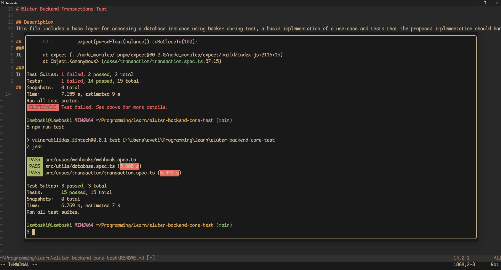

# Eluter Backend Transactions Test

## Description
This file includes a base layer for accessing a database instance using Docker during test, a basic implementation of a use-case and tests that the proposed implementation should handle

## Cases
### Transaction
It simulates a user account with balance and a withdraw request that must debit the account and trigger an effect mocking an external service call

### Webhook
It simulates webhook processing logic

## Tests Results
Both `webhooks/webhook.spec.ts` and `transaction/transaction.spec.ts` passing:

Also removed `naiveTransaction` and `noChecks` functions to remove noise.
